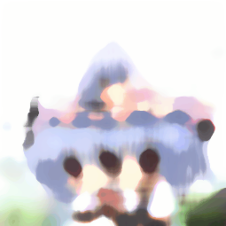

# aznyan


<!-- README.md is generated from README.qmd. Please edit that file -->

<!-- badges: start -->

[](https://paithiov909.r-universe.dev/aznyan)
<!-- badges: end -->

aznyan is a collection of image effects for R that wraps
[OpenCV](https://opencv.org/), ported from
[5PB-3-4/AviUtl_OpenCV_Scripts](https://github.com/5PB-3-4/AviUtl_OpenCV_Scripts).

Still in development…

## Usage

aznyan provides functions that take a `raw` vector of image data as
their first argument and return a `raw` vector of PNG format image after
applying the effect.

You can simply read a PNG image into a raw vector using `readBin()` and
save those return values as a PNG image using `writeBin()`.

``` r
pkgload::load_all(export_all = FALSE)
#> ℹ Loading aznyan

png <- readBin(
  system.file("images/sample-256x256.png", package = "aznyan"),
  what = "raw",
  n = file.info(system.file("images/sample-256x256.png", package = "aznyan"))$size
)
```

The original image `png` above looks like this:


### Blur

``` r
median_blur(png, ksize = 8) |>
  png::readPNG(native = TRUE) |>
  grid::grid.raster(interpolate = FALSE)
```


