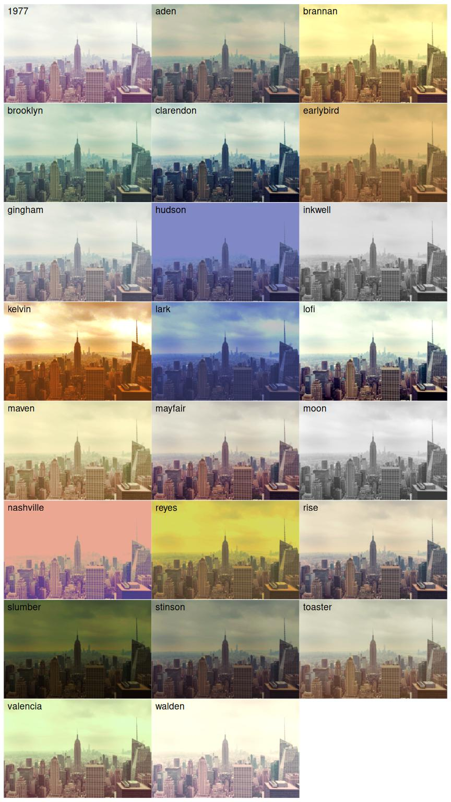

# aznyan


<!-- README.md is generated from README.qmd. Please edit that file -->

<!-- badges: start -->

[](https://github.com/paithiov909/aznyan/actions/workflows/R-CMD-check.yaml)
<!-- badges: end -->

aznyan is a collection of image filters for R that wraps
[OpenCV](https://opencv.org/), ported from
[5PB-3-4/AviUtl_OpenCV_Scripts](https://github.com/5PB-3-4/AviUtl_OpenCV_Scripts).

Still in development. It will probably work, but the API is likely to
change.

## Usage

aznyan provides functions that take a `nativeRaster` of image data as
their first argument and return a `nativeRaster` after applying the
effect. All these functions return a new `nativeRaster` and do not
modify the input object in place.

A `nativeRaster` is a built-in datatype in R that stores image data as an
integer matrix. There are several common ways to obtain a `nativeRaster`
object:

- Generate or manipulate a `nativeRaster` using
  [nara](https://github.com/coolbutuseless/nara)
- Capture the contents of a graphics device with
  [`ragg::agg_capture()`](https://ragg.r-lib.org/reference/agg_capture.html)
- Read image files using functions such as
  - `jpeg::readJPEG(native = TRUE)`
  - `png::readPNG(native = TRUE)`
  - `fastpng::read_png(type = "nativeraster")`
  - `aznyan::read_still()`

For example, you can read a PNG image as a `nativeRaster` like this:

``` r
library(ggplot2)
library(patchwork) # for layouting native rasters

png <-
  aznyan::read_still(system.file("images/aznyan-256x256.png", package = "aznyan"))
```

This `png` object corresponds to the following image:


With aznyan, you can easily apply various effects to a `nativeRaster`
image.

``` r
blur <-
  wrap_elements(full = aznyan::median_blur(png, ksize = 8)) +
  labs(title = "Median Blur")
diffusion <-
  wrap_elements(full = aznyan::diffusion_filter(png, factor = 8)) +
  labs(title = "Diffusion Filter")
morph <-
  wrap_elements(full = aznyan::morphology(png, ksize = c(4, 4, 4))) +
  labs(title = "Morphological\nTransformation")

(blur | diffusion | morph)
```


In addition to general-purpose image effects, aznyan also provides
photo-style color filters ported from
[Rustagram](https://github.com/ha-shine/rustagram), such as the
following:



In practice, a convenient way to use aznyan is as a custom filter via
[`ggfx::with_custom()`](https://ggfx.data-imaginist.com/reference/with_custom.html),
which allows you to apply effects to arbitrary ggplot layers. For
example:

``` r
library(ggfx)

my_effect <- \(x, ...) {
  vp <- get_viewport_area(x)
  vp <- aznyan::stylize(vp, ...)
  set_viewport_area(x, vp)
}

ggplot(mpg) +
  with_custom(
    geom_density(aes(cty, fill = drv), alpha = 0.4, adjust = 2),
    filter = my_effect
  ) +
  scale_fill_viridis_d(option = "plasma")
```


## License

MIT License.
